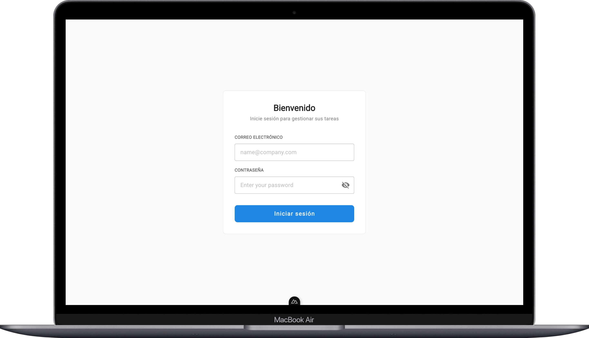
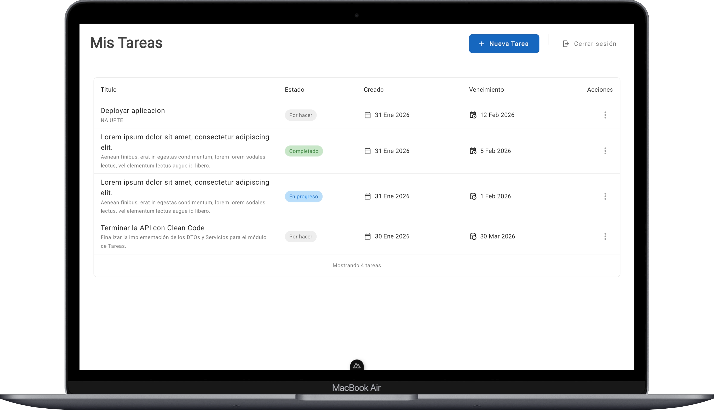
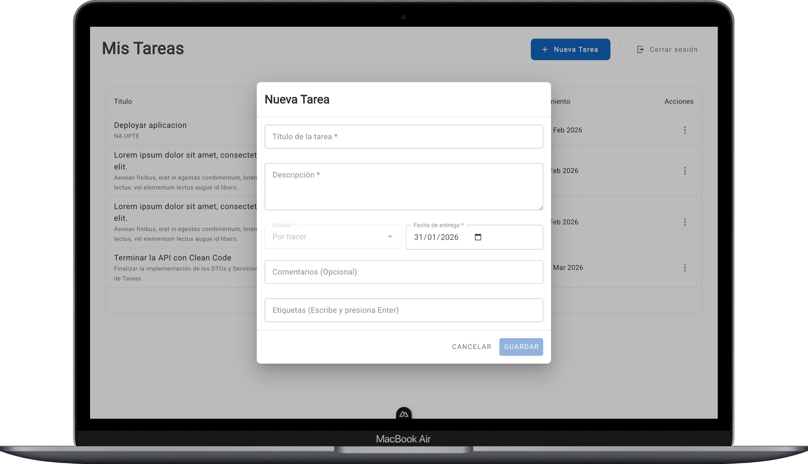
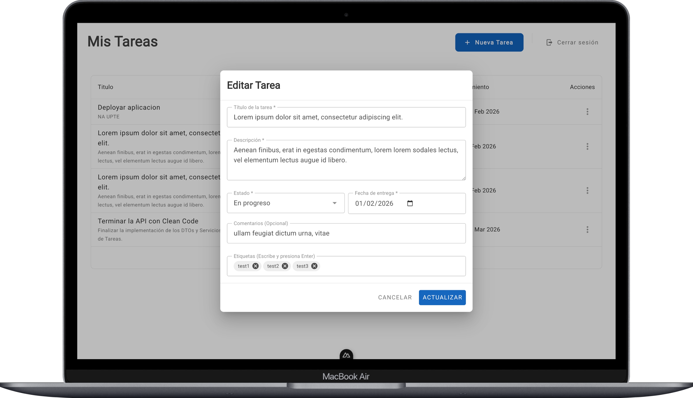
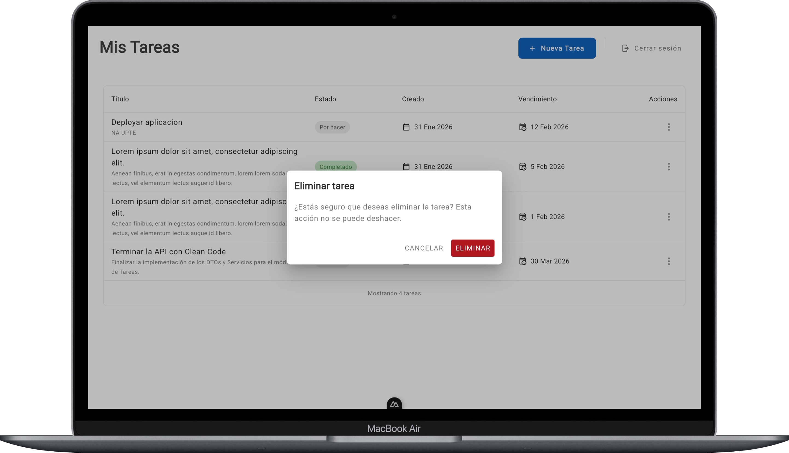

# Gestor de Tareas

Este proyecto es una aplicación web desarrollada con **Nuxt 4** y **Vue 3** que funciona como **frontend de un gestor de tareas**.  
La aplicación permite al usuario autenticarse y gestionar sus tareas, incluyendo:

- **Login** con correo y contraseña.
- **Listado de tareas** con título, descripción, estado, fechas y acciones.
- **Crear, editar y eliminar** tareas mediante modales.
- **Estados de tarea:** Por hacer, En progreso, Completado.
- **Navegación** entre pantalla de inicio (login) y listado de tareas tras autenticación.

---

## 🛠️ Tecnologías Utilizadas

- **Framework:** Nuxt 4 + Vue 3
- **Lenguaje:** TypeScript
- **UI:** Vuetify 3 (vuetify-nuxt-module)
- **Fuentes:** @nuxt/fonts
- **HTTP:** $fetch (Nuxt) para consumo de API
- **Enrutamiento:** Vue Router (integrado en Nuxt)
- **Estado / persistencia:** Cookies (`useCookie`) para token de autenticación

---

## 📋 Requisitos Previos

Para ejecutar este proyecto necesitas:

- **Node.js:** v18.x o superior (recomendado v20.x)
- **npm:** v9.x o superior (incluido con Node)

No se requiere CLI global adicional; Nuxt se ejecuta a través de los scripts de `npm`.

---

## 🚀 Instrucciones de Instalación y Ejecución

Sigue estos pasos para ejecutar el proyecto en tu entorno local:

1. **Clonar el repositorio:**

   ```bash
   git clone <URL_DE_TU_REPOSITORIO>
   cd nexline-front
   ```

2. **Instalar dependencias:**

   ```bash
   npm install
   ```

3. **Configurar variables de entorno:**

   Crea un archivo `.env` en la raíz del proyecto (o copia desde `.env.example` si existe) y define la URL base de tu API, por ejemplo:

   ```env
   NUXT_PUBLIC_API_BASE=http://127.0.0.1:8000
   ```

4. **Ejecutar el servidor de desarrollo:**

   ```bash
   npm run dev
   ```

5. **Abrir en el navegador:**

   Navega a `http://localhost:3000/` (puerto por defecto de Nuxt).  
   La aplicación se recargará automáticamente si modificas archivos fuente.

---

## 🔐 Variables de Entorno y API

El frontend consume una **API REST** de backend (gestor de tareas). La configuración se realiza mediante variable de entorno:

- **`NUXT_PUBLIC_API_BASE`:** URL base del backend (ej: `http://127.0.0.1:8000`).

En Nuxt 3/4, las variables que empiezan por `NUXT_PUBLIC_` se exponen en el cliente y están disponibles en `useRuntimeConfig().public`. En este proyecto:

- **apiBase** se define en `nuxt.config.ts` bajo `runtimeConfig.public.apiBase` y se rellena con `NUXT_PUBLIC_API_BASE`.

### Endpoints utilizados

- **POST** `/api/login` — Inicio de sesión (email, password). Devuelve `access_token`.
- **GET** `/api/tasks` — Listado de tareas (requiere cabecera `Authorization: Bearer <token>`).
- **POST** `/api/tasks` — Crear tarea.
- **PUT** `/api/tasks/:id` — Actualizar tarea.
- **DELETE** `/api/tasks/:id` — Eliminar tarea.

El token se guarda en una cookie (`auth_token`) y se envía en las peticiones a `/api/tasks` mediante el composable `useActionTask`.

**Configuración local:**

1. Crea un archivo `.env` en la raíz con `NUXT_PUBLIC_API_BASE=<url_de_tu_backend>`.
2. Asegúrate de que el backend esté en ejecución y accesible desde esa URL.

---

## ✅ Scripts Disponibles

En la raíz del proyecto puedes ejecutar:

- **Desarrollo:**

  ```bash
  npm run dev
  ```

- **Build para producción:**

  ```bash
  npm run build
  ```

- **Generar sitio estático (SSG):**

  ```bash
  npm run generate
  ```

- **Vista previa del build de producción:**

  ```bash
  npm run preview
  ```

- **Preparar Nuxt (postinstall):**

  ```bash
  npm run postinstall
  ```

  Se ejecuta automáticamente tras `npm install` (`nuxt prepare`).

---

## 💡 Decisiones Técnicas

### 1. Arquitectura de Navegación (Nuxt + Layouts)

- **Nuxt** gestiona rutas basadas en el directorio `app/pages/`:
  - **`/`** (`index.vue`): pantalla de login.
  - **`/tasks`** (`tasks.vue`): listado y gestión de tareas (protegido por uso de token en composables).
- Se utilizan dos **layouts**:
  - **`auth`:** pantalla centrada sin cabecera (login).
  - **`default`:** contenedor con fondo y ancho máximo para la zona de tareas.
- Cada página define su layout con `definePageMeta({ layout: 'auth' })` o `layout: 'default'`.
- Tras un login correcto se redirige a `/tasks` con `navigateTo('/tasks')`; al cerrar sesión, a `/` con `navigateTo('/')`.

### 2. Autenticación y Datos (useAuth + useActionTask)

- **`useAuth`** (`app/composables/useAuth.ts`):
  - Login con `$fetch` a `POST /api/login` y body `LoginPayload` (email, password).
  - Guarda el `access_token` en cookie `auth_token` con `useCookie`.
  - Expone `login`, `logout`, `token` e `isLoggedIn` (computed).
  - Tras login exitoso redirige a `/tasks`; en logout redirige a `/`.
- **`useActionTask`** (`app/composables/useActionTask.ts`):
  - Obtiene el listado de tareas con `useFetch` a `GET /api/tasks`, enviando `Authorization: Bearer <token>`.
  - Expone `createTask`, `updateTask`, `deleteTask` con `$fetch` (POST, PUT, DELETE) y las mismas cabeceras.
  - Devuelve `tasks`, `refresh`, `pending`, `error`, `status` para que la página de tareas reaccione a datos y estado de carga/error.
- Las interfaces **AuthResponse**, **LoginPayload**, **Task** y **TaskResponse** centralizan los tipos de la API en `app/interfaces/`.

Esta separación (composables + interfaces) mantiene la lógica de auth y CRUD fuera de los componentes y facilita reutilización y pruebas.

### 3. UI y Componentes (Vuetify + composable useTaskUI)

- **Vuetify 3** se integra mediante **vuetify-nuxt-module**; la UI usa componentes como `v-card`, `v-data-table`, `v-dialog`, `v-btn`, `v-text-field`, etc.
- **`useTaskUI`** (`app/composables/useTaskUI.ts`):
  - Proporciona etiquetas y colores por estado (`todo`, `progress`, `done`).
  - Formatea fechas con `Intl.DateTimeFormat` en locale `es-ES`.
  - Se usa en la tabla de tareas para chips de estado y fechas (creación, vencimiento).

### 4. Componentes Reutilizables

- **`SharedHeader`** (`app/components/shared/Header.vue`):
  - Título "Mis Tareas", botón "Nueva Tarea" (emite `click:create`) y botón "Cerrar sesión" (usa `useAuth().logout`).
- **`TaskTable`** (`app/components/task/Table.vue`):
  - Tabla con columnas: título/descripción, estado, creado, vencimiento, acciones.
  - Usa `useTaskUI` para estado y fechas; menú de acciones (Editar / Eliminar) con eventos `click:edit` y `click:delete`.
- **`TaskModalForm`** (`app/components/task/ModalForm.vue`):
  - Modal para crear o editar tarea (título, descripción, estado, fecha de entrega, comentarios, etiquetas).
  - Controlado por `v-model` (visibilidad) y prop `taskToEdit`; emite `save` con el objeto tarea.
- **`TaskModalDelete`** (`app/components/task/ModalDelete.vue`):
  - Diálogo de confirmación de borrado; emite `confirm` y soporta estado `loading`.
- **`TaskFilters`** (`app/components/task/Filters.vue`):
  - Filtros por estado (Todas, Por hacer, En progreso, Completado) y campo de búsqueda; preparado para integrarse con el listado si se desea filtrar en cliente o enviar parámetros al backend.

---

## 📂 Estructura del Proyecto

```plaintext
nexline-front/
├── app/
│   ├── app.vue                    # Raíz: NuxtLayout + NuxtPage
│   ├── components/
│   │   ├── shared/
│   │   │   └── Header.vue         # Cabecera con título, Nueva Tarea y Cerrar sesión
│   │   └── task/
│   │       ├── Filters.vue        # Filtros por estado y búsqueda
│   │       ├── ModalDelete.vue    # Diálogo confirmar eliminar
│   │       ├── ModalForm.vue      # Modal crear/editar tarea
│   │       └── Table.vue          # Tabla de tareas con acciones
│   ├── composables/
│   │   ├── useActionTask.ts       # useFetch + CRUD tareas (API)
│   │   ├── useAuth.ts             # Login, logout, token (cookie)
│   │   └── useTaskUI.ts           # Etiquetas/colores estado y formato fechas
│   ├── interfaces/
│   │   ├── auth-response.interface.ts
│   │   ├── filter-option.interface.ts
│   │   ├── login-payload.interface.ts
│   │   ├── task-response.interface.ts
│   │   └── task.interface.ts
│   ├── layout/
│   │   ├── auth.vue               # Layout login (centrado, sin cabecera)
│   │   └── default.vue            # Layout contenido (contenedor principal)
│   ├── pages/
│   │   ├── index.vue              # Página de login
│   │   └── tasks.vue              # Página listado y CRUD tareas
│   └── types/
│       └── task-filter.type.ts    # 'all' | 'todo' | 'progress' | 'done'
├── public/
│   ├── favicon.ico
│   └── robots.txt
├── .env                           # NUXT_PUBLIC_API_BASE (no versionado)
├── nuxt.config.ts                 # Configuración Nuxt + runtimeConfig.public.apiBase
├── package.json
├── tsconfig.json
└── README.md
```

---

## 📸 Previsualización de la Aplicación


### Login



### Gestión de tareas









---